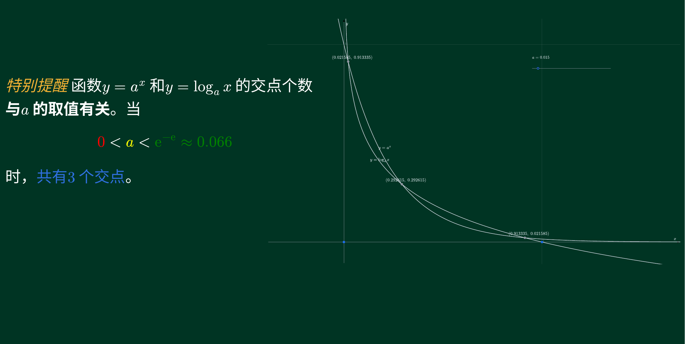

# vas

A local-first handwriting notebook and whiteboard that runs entirely in the browser.
Open a page and start writing — no download, no account, no backend. Your notes stay on
your device.

**[Online demo](https://gengyunmaster.github.io/vas/)** — works on desktop, tablet, and
phone. Notebooks are stored per origin in the browser's IndexedDB, so the demo site and a
self-hosted instance keep separate data; use export / import to move notebooks around.

## Features

- **Natural pen feel** — pressure-sensitive strokes (Apple Pencil & compatible pens),
  velocity-simulated pressure for finger and mouse, low-latency canvas rendering
- **Paginated notebooks** — continuous vertical scrolling, pinch zoom up to 20x with
  crisp vector redraw; page size is per-page (A4-proportioned 794×1123 by default,
  adjustable per page from 200 to 5000 px, mixed sizes within one notebook)
- **Tools** — pen, highlighter, stroke eraser, laser pointer (for teaching), and shapes
  (line / arrow / rectangle / ellipse)
- **Text** — click anywhere with the text tool to place a markdown text box (source
  textarea + live preview): headings, lists, quotes, code, bold/italic/strikethrough,
  links (ink-colored and underlined everywhere; clickable in SVG and PDF exports),
  dividers, inline/block LaTeX math (KaTeX on screen, MathJax glyphs in exports),
  colored spans via `{#hex|text}` (also inside math, where it maps to scoped `\textcolor`;
  LaTeX `\color` / `\textcolor` work too, in exports via MathJax's color extension), and embedded notebook images via ``;
  boxes layer between images and ink, join lasso / recolor / cut-copy-paste, and refuse
  input at the page bottom (no cross-page overflow)
- **Lasso selection** — circle content to select it, then move, scale / stretch (staying
  vector), recolor, delete, and cut / copy / paste — across pages and notebooks
- **Images** — insert images (button or paste from the system clipboard) and annotate
  over them; images move / scale / copy along with the selection; oversized images are
  auto-fit to the page and stored at original quality. The picker also accepts **PDF
  files**: after the same password/decrypt flow you pick a single page, which is
  inserted as a regular (selectable, movable, scalable) image — rendered on screen as
  a 4x transparent-background preview (the white backdrop is keyed out), stored with
  the full original PDF, and re-embedded as a true vector page on PDF export
- **PDF import** — import a PDF from the home screen to create a notebook, or into the
  open notebook (pages inserted after the current one, inheriting its style); every page
  is rendered at 4x point resolution, scaled to fill the sheet, and locked in place
  (lasso can't select it); home-screen imports size each page after its PDF page;
  annotate freely on top; password-protected PDFs are decrypted in the
  browser on import (qpdf-wasm, password prompted once) and stored without a password,
  so exports can re-embed them as true vector pages
- **Per-page paper** — paper colors (presets incl. blackboard green and calligraphy tan,
  plus custom hex) and background templates (blank / lined / grid / dots / rice grid),
  with contrast-aware guide lines
- **Page management** — insert / delete / clear pages, automatic page continuation,
  thumbnail sidebar with aspect-accurate previews and long-press drag to reorder
- **Presentation mode** — full-screen slideshow: one page fitted to the screen on a
  black backdrop, wheel / swipe / arrow-key paging with a scroll animation, writing
  stays enabled
- **Multiple notebooks** — home screen with create / rename / delete, plus merging:
  select notebooks to combine their pages into a new one (selection order preserved;
  a single selection duplicates a notebook; shared images stay stored once)
- **Geometry board** — a full-screen geometry editor (points, segments, circles,
  perpendiculars, angle bisectors, axes, function plots, sliders, animations, LaTeX
  labels) embedded into the page as a transparent-background SVG figure, cropped to its
  content; select the figure and hit Edit to reopen the editor and replace it in place;
  figures stay vector in SVG and PDF exports, with LaTeX labels rendered as MathJax
  glyphs
- **Local-first storage** — IndexedDB autosave, per-notebook view state (scroll position
  and zoom restored on reopen, also carried in exports), JSON export for image-less
  notebooks and zip export (JSON + image files + original PDFs + geometry documents)
  for notebooks with images, PDF pages, or geometry figures, both re-importable
- **Vector PDF export** — strokes stay sharp at any zoom level, inserted SVG images stay
  vector too, raster images embedded from the original bytes (JPEG/PNG); imported PDF
  pages (both locked base pages and PDFs inserted as images) keep their original bytes,
  which are re-embedded as a true vector layer on export (with raster fallback for
  encrypted files); text is drawn
  as real, selectable PDF text with an embedded subset of Noto Sans SC; layers stack in
  the same order as on screen (paper < images < text < ink)
- **Flexible export scopes** — every export offers three scopes: the current selection
  (clipped to its bounds, transparent background, no paper color / guides / PDF base
  image — white background for PDF, which has no transparency concept), the current
  page, or the whole notebook (trailing blank pages trimmed); pick PDF, vector SVG, or
  2x PNG, and multi-page SVG/PNG exports download as a zip
- **PWA** — installable and fully offline; all assets (including the on-demand PDF
  engine) are precached

## Screenshots

| Calligraphy practice (tan paper preset)           | Annotating an imported PDF                 | Markdown text with LaTeX math and an embedded geometry figure |
| ------------------------------------------------- | ------------------------------------------ | ------------------------------------------------------------- |
|      |  |     |

## Tech stack

React 19 · TypeScript · Vite · zustand · perfect-freehand · idb · jsPDF + svg2pdf.js
(lazy-loaded) · pdfjs-dist (lazy-loaded) · pdf-lib + @pdf-lib/fontkit (lazy-loaded) ·
@neslinesli93/qpdf-wasm (lazy-loaded) · fflate · markdown-it (text tool, with custom
math / color / image-sanitizing rules) · subsetted Noto Sans SC fonts (shared by screen
layout and PDF text) · JSXGraph + mathlive + @cortex-js/compute-engine + KaTeX +
MathJax (geometry editor, lazy-loaded) ·
vite-plugin-pwa · Biome · Vitest — no UI component library, no backend.

## Project structure

```
src/
  components/    React UI (Home, Toolbar, SettingsPanel, PageSidebar, SelectionBar,
                 GeometryOverlay, TextOverlay/TextEditor, ...)
  engine/        rendering engine: board, viewport, pageCache, imageCache,
                 renderPage/renderStroke/patterns/shapes, canvas
  geo/           geometry board: App, model (pure document model), board (JSXGraph
                 sync & palette), tools, ui (inspector/export pipeline), history,
                 latexSvg (MathJax), test
  model/         data model & pure functions: stroke, page, pageSize, color, image,
                 viewState, hitTest, patternLayout, shapeGeometry, selection, transform,
                 pdfPage, textItem
  markdown/      markdown-it wrapper with custom rules (math, colored spans, image
                 sanitizing), block parsing, safe HTML rendering, KaTeX lazy-loading
  text/          text layout engine (shared by all exports), metrics, height cache,
                 frame bus, PNG/SVG paint backends
  store/         zustand stores
  persistence/   IndexedDB (db, notebooks, images, pdfs, geometries, transfer, autosave,
                 prefs, session), insertImage, importPdf, decryptPdf, rasterize,
                 exportPdf, exportImage, exportSvg, exportZip, pdfTextLayer, svgPath,
                 imageDataUri
  pwa/           service worker registration
public/          PWA icons (generated by scripts/generate-icons.mjs) and fonts/
                 (subsetted Noto Sans SC, scripts/subset-fonts.mjs)
scripts/         one-off utility scripts
deploy/          nginx config for the Docker runtime stage
```

## Getting started (development)

Requirements: **Node.js >= 20.19** (22 or 24 LTS recommended).

```bash
git clone https://github.com/gengyunmaster/vas.git
cd vas
npm ci
npm run dev
```

Open <http://localhost:5173> in your browser.

### Scripts

| Command           | Description                              |
| ----------------- | ---------------------------------------- |
| `npm run dev`     | Start the dev server                     |
| `npm run build`   | Type-check + production build            |
| `npm run preview` | Preview the production build             |
| `npm test`        | Run unit tests                           |
| `npm run lint`    | Biome check                              |
| `npm run format`  | Biome auto-format                        |

## Docker

The image is a multi-stage build: the app is compiled in a Node stage (lint + tests as a
quality gate) and served by an unprivileged nginx in the runtime stage.

```bash
docker build -t vas:latest .
docker run -d --name vas -p 8080:8080 vas:latest
```

Or with Docker Compose:

```bash
docker compose up -d --build
```

The container serves plain HTTP on port **8080**. Put your TLS-terminating reverse proxy
in front of it — HTTPS (or localhost) is required for the PWA features (install to home
screen, offline use), because service workers only run in a secure context.

## Offline / air-gapped deployment

Export the built image as a `.tar.gz` archive, copy it to a machine without internet
access (USB drive, scp, ...), and load it there:

```bash
# on the build machine
docker save vas:latest | gzip > vas-latest.tar.gz

# on the offline target machine
gunzip -c vas-latest.tar.gz | docker load
docker run -d --name vas -p 8080:8080 vas:latest
```

Then open `http://<host>:8080` in a browser.

## Data & privacy

All notes live in the browser's IndexedDB on the device they were written on — nothing
leaves your device. Use the JSON/zip export on the home screen to back up or move a
notebook between devices (zip when the notebook contains images or PDF pages).

## Contributing

Bug reports and pull requests are welcome. `AGENTS.md` (Chinese) contains the full
architecture and conventions guide for developers and AI coding assistants — please read
it before making changes.

## License

[MIT](LICENSE)
